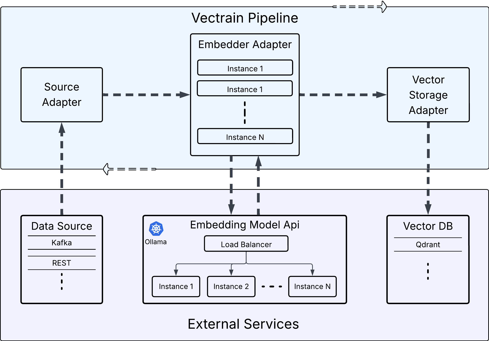

# Vectrain — Vector Embeddings Pipeline

## Overview

**Vectrain** is a high-performance vector embedding service built in Go. It provides a flexible and modular pipeline architecture for sourcing data, generating embeddings, and storing them in vector databases. Designed for scalability, Vectrain enables seamless integration of embeddings into semantic search, analytics, and recommendation systems.

## Features

- **Pipeline Architecture**: Modular system with source, embedder, and storage components
- **Sources**
  - **Kafka Integration**: Stream processing from Kafka topics
  - **REST Integration**: Accept data from external services via REST endpoints
- **Embedding**
  - **Vector Embeddings**: Generate embeddings using Ollama models
- **Storage**
  - **Qdrant Storage**: Store and query vector embeddings in Qdrant database
- **Configurable Components**: Easily adjust batch sizes and worker counts
- **HTTP API**: RESTful API for controlling and interacting with the pipeline

## Pipeline



### Description

Vectrain’s pipeline manages the entire process of transforming raw data into vector embeddings.

### Architecture

Vectrain implements a three-stage pipeline architecture:

1. **Source** - Reads data from configured sources (Kafka)
2. **Embedder** - Generates vector embeddings from the source data
3. **Storage** - Persists embeddings to vector databases (Qdrant)

#### Key points

- Configurable Adapters: When starting the pipeline, you specify the types of `source`, `storage`, and `embedder`. These adapters interface with external services.
- Supported Sources: Currently, Vectrain supports `Kafka` and `REST` services for data ingestion.
- Embedding Services:
  - Currently, the pipeline supports `Ollama` as the embedding service.
  - Since ML models are the main bottleneck, multiple embedder instances can be run in parallel.
  - External embedding services can also be scaled with multiple instances and a load balancer to accelerate processing.
- Vector Database: Currently, Vectrain supports `Qdrant` for storing and querying embeddings.

### Workflow

- The pipeline is started via a REST API request (`http://127.0.0.1/api/start`).
- It connects to the configured source and storage adapters.
- The source retrieves data from the external system (Kafka or REST, depending on configuration). More sources may be added in the future.
- Data is sent to the embedding service API (e.g., Ollama, OpenAI, or other providers).
- Once embeddings are generated, the pipeline stores them in the vector database.
- The process repeats until all messages are processed or the pipeline receives a stop command (`http://127.0.0.1/api/stop`)..


## Requirements

- Go 1.24+
- Docker (for running dependencies like Kafka, Ollama, Qdrant)

## Installation

### 1. Clone the repository

```bash
git clone https://github.com/torys877/vectrain.git
cd vectrain
```

### 2. Install dependencies

```bash
go mod tidy
```

## Configuration

Update the example configuration files in `./config` with your endpoints and settings.  
Create `config/config.yaml` and use `kafka_config.yaml` or `rest_config.yaml` as example depending on whether you want to receive data from Kafka or a REST service.

## Usage

### Running the application

```bash
go run cmd/vectrain/main.go --config=config/config.yaml
```

Or build and run the binary:

```bash
go build -o vectrain cmd/vectrain/main.go
./vectrain --config=config/config.yaml
```

### API Endpoints

The service exposes HTTP endpoints for controlling the pipeline and retrieving information:

- `GET /health`: Check service health
- `POST /start`: Start workflow
- `POST /stop`: Stop workflow

Each component is pluggable and configurable through the YAML configuration file.

## Development

### Adding new source types

Implement the `Source` interface from `pkg/types/source.go` in `internal/app/sources`

### Adding new embedder types

Implement the `Embedder` interface from `pkg/types/embedder.go` in `internal/app/embedders`

### Adding new storage types

Implement the `Storage` interface from `pkg/types/storage.go` in `internal/app/storages`

### Adding Instances to the Factory

To register a new `source`, `embedder`, or `storage`, update the factory implementation in `app/factory/factory.go`.  
The factory should return the correct instance based on the specified type.

## Sources

### HTTP (REST) Source

Http source has own API to receive messages. 
To send message use endpoint `http://127.0.0.1/source/send` with body like:

```json
{
  "Text": "Some text that needs embedding",
  "Payload": {
    "genres": "Comedy, Drama, Romance, Crime",
    "rating": "7.10",
    "title": "SomeTitle",
    "year": "1988-10-21"
  }
}
```

> **Note:** The source API remains available even if the pipeline is stopped.  
> However, messages will not be embedded until the pipeline is started.

## License

[MIT License](LICENSE)
